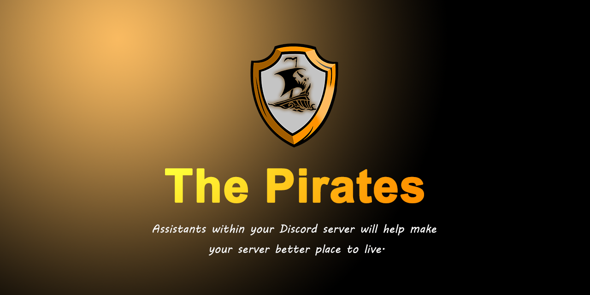

<div align="center" id="top"> 
  <!--  -->
  
  &#xa0;

</div>

<h1 align="center"><a href="https://dapirates.xyz">Demo</a></h1>

<p align="center">
  

  

  

  

  

  

  
</p>

<!-- Status -->

<h4 align="center"> 
	🚧  The Pirates 🚀 Under construction...  🚧
</h4> 

<hr>

<p align="center">
  <a href="#dart-about">About</a> &#xa0; | &#xa0; 
  <a href="#sparkles-features">Features</a> &#xa0; | &#xa0;
  <a href="#rocket-technologies">Technologies</a> &#xa0; | &#xa0;
  <a href="#white_check_mark-requirements">Requirements</a> &#xa0; | &#xa0;
  <a href="#checkered_flag-starting">Starting</a> &#xa0; | &#xa0;
  <a href="#memo-license">License</a> &#xa0; | &#xa0;
  <a href="https://github.com/birajx" target="_blank">Author</a>
</p>

<br>

## 🎯 About ##


## ✨ Features ##

✔️ Coming Soon!\
✔️ Coming Soon\
✔️ Comming Soon

## 🚀 Technologies ##

The following tools were used in this project:

- [Node.js](https://nodejs.org/en/)
- [Express.js](https://expressjs.com)


## ✅ Requirements ##

Before starting 🏁, you need to have [Git](https://git-scm.com) and [Node](https://nodejs.org/en/) installed.

## 🏁 Starting ##

```bash
# Clone this project
$ git clone https://github.com/birajx/thepirates

# Access
$ cd thepirates

# Install dependencies
$ pnpm install

# Run the project
$ pnpm start

# The server will initialize in the <http://localhost:3000>
```

## 📝 License ##

This project is under license from MIT. For more details, see the [LICENSE](LICENSE.md) file.


Made with ❤️ by <a href="https://github.com/birajx" target="_blank">birajx</a>

&#xa0;

<a href="#top">Back to top</a>
